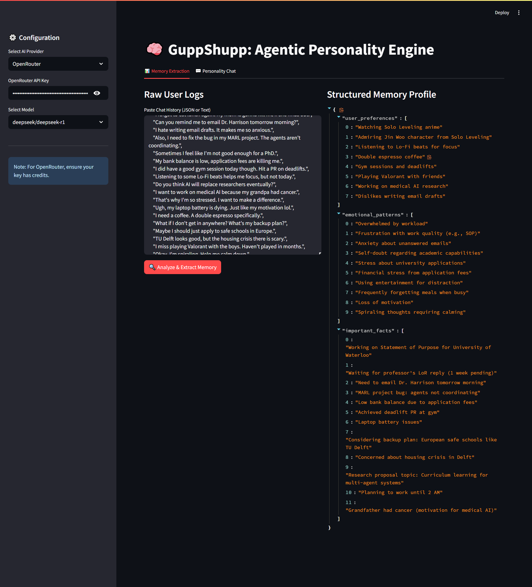

# GuppShupp Assignment: Memory & Personality Engine

This repository contains a modular AI companion system designed to demonstrate structured memory extraction and dynamic persona adaptation. The system is built using a dual-agent architecture that separates the analytical processing of user history from the conversational logic.

**Live Deployment:** [https://guppshupp-ai-engineer-assignment-yedwwfervyu6z5fukunbhg.streamlit.app/]

## System Architecture

The project implements a separation of concerns through two distinct agents:

1.  **Memory Agent (Analytical Layer):**
    *   Processes raw chat logs using `langchain` and `pydantic`.
    *   Extracts structured metadata into a strict schema: `User Preferences`, `Emotional Patterns`, and `Important Facts`.
    *   Converting unstructured text into a queryable Knowledge Graph.

2.  **Conversation Agent (Interaction Layer):**
    *   Utilizes the extracted memory profile to generate context-aware responses.
    *   Implements **Role-Based Memory Filtering**: A mechanism that programmatically allows or forbids specific memory categories based on the active persona. This prevents tonal inconsistencies (e.g., preventing a professional mentor from referencing casual pop culture).

## Features

*   **Structured Output Parsing:** Enforces valid JSON output for memory extraction, ensuring reliability downstream.
*   **Context-Aware RAG:** Injects relevant user history into the context window dynamically.
*   **Model Agnosticism:** Implements a Factory Pattern (`LLMFactory`) to support Google Gemini, Anthropic Claude, and OpenRouter/DeepSeek seamlessly.

## Demonstration

### 1. Memory Extraction
The system analyzes 30 raw messages to build a user profile.



### 2. Persona Adaptation
The engine generates distinct responses to the same user query ("I'm worried about my applications") based on the active persona configuration.

**Persona: Calm Mentor**
*Note: The system filters out anime references and focuses on academic facts (LoR, Deadlines).*


**Persona: Witty Friend**
*Note: The system activates pop-culture memories (Solo Leveling, Gym PRs) and adopts a casual tone.*


**Persona: Therapist**
*Note: The system focuses on emotional patterns and anxiety triggers identified in the memory profile.*


## Installation & Usage

### Prerequisites
*   Python 3.9+
*   API Key for Google Gemini, Anthropic, or OpenRouter

### Local Setup

1.  Clone the repository:
    ```
    git clone https://github.com/YOUR_USERNAME/guppshupp-assignment.git
    cd guppshupp-assignment
    ```

2.  Install dependencies:
    ```
    pip install -r requirements.txt
    ```

3.  (Optional) Configure Environment:
    Create a `.env` file in the root directory:
    ```
    GOOGLE_API_KEY=your_key_here
    ```

4.  Run the application:
    ```
    streamlit run app.py
    ```

## Project Structure

*   `app.py`: Main entry point and UI logic (Streamlit).
*   `src/llm_factory.py`: Handles model instantiation and abstraction.
*   `src/memory_agent.py`: Logic for analyzing history and extracting JSON data.
*   `src/conversation_agent.py`: Logic for persona management and context injection.
*   `data/`: Contains sample synthetic datasets for testing.

## Note for Reviewers

The deployed application on Streamlit Cloud does not have hardcoded API keys for security reasons. Please enter your own API key in the sidebar to verify the functionality. The system supports Google Gemini (recommended), Anthropic, and OpenRouter.
